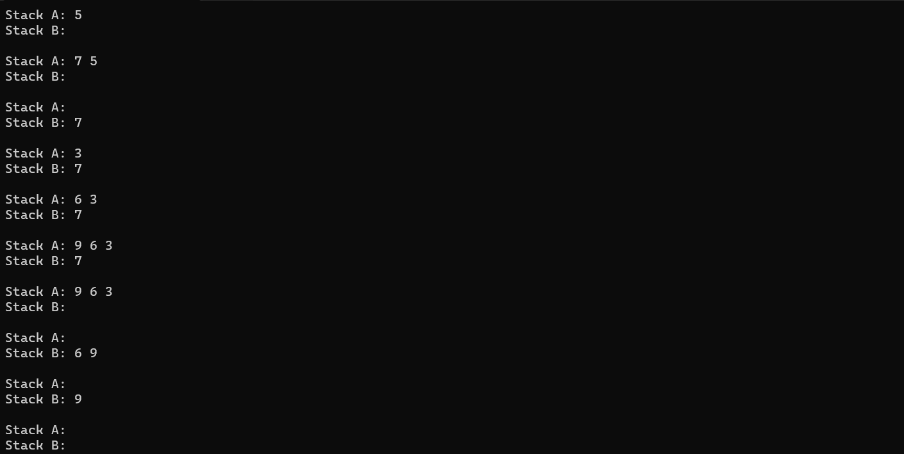

# Amortized Analysis Homework
I counstructed a C++ program to research this problem, which can be found in this folder

## Problem 1
Right side represents the stack top
1. Step 1

|stack A | 5 |
|-|-|

|stack B |
|-|

2. Step 2

|stack A | 7 | 5 |
|-|-|-|

|stack B |
|-|

3. Step 3
- pop from stack A, push to stack B

|stack A |
|-|

|stack B | 5 | 7 |
|-|-|-|

- pop from stack B

|stack A |
|-|

|stack B | 7 |
|-|-|

4. Step 4

|stack A | 3 |
|-|-|

|stack B | 7 |
|-|-|

5. Step 5

|stack A | 3 | 6 |
|-|-|-|

|stack B | 7 |
|-|-|

6. Step 6

|stack A | 3 | 6 | 9 |
|-|-|-|-|

|stack B | 7 |
|-|-|

7. Step 7

- pop from stack A, push to stack B. until stack A is empty

|stack A |
|-|

|stack B | 9 | 6 | 3 | 7 |
|-|-|-|-|-|

- pop from stack B

|stack A |
|-|

|stack B | 6 | 3 | 7 |
|-|-|-|-|

8. Step 8

|stack A |
|-|

|stack B | 3 | 7 |
|-|-|-|

9. Step 9

|stack A |
|-|

|stack B | 7 |

10. Step 10

|stack A |
|-|

|stack B |
|-|

Here is a sample output:

## Problem 2
As cost of a push or a pop cost 1 unit of work. 
- push into queue: 
    - push x onto stack A: 1 unit

**In total: 1 unit**

> $n$ represents the number of elements in the stack A
> the number of elements in stack B is irrelevant

- pop from queue:
    - if B is not empty:
        - pop from stack B: 1 unit

    - if B is empty:
        - pop from stack A (n units), push to stack B (n units), until stack A is empty: 2n units
        - pop from stack B: 1 unit

**In total: 1 unit if B is not empty, 2n + 1 units if B is not empty**

1. In case that all enqueue operations are grouped together, the total cost is $n$ units
and all the dequeue operations are grouped together, the first dequeue operation costs $n$ units, and the rest of dequeue operations cost 1 unit each, taking place n - 1 times. So the total cost is $2n - 1$ units.
This is a total of $3n - 1$ units of work.

2. In case that enqueue and dequeue operations are interleaved. Each enqueue operation costs 1 unit, and each dequeue operation costs 1 unit if B is not empty, and $2n + 1$ units if B is empty. Given that B is always empty (always emptied after each dequeue operation), and that n would be equal to 1. So the dequeuing cost of each operation is $3$ units. So each enqueue-dequeue pair costs $4$ units. So the total cost is $4n$ units. This is possibly the worst case. 

## Problem 3