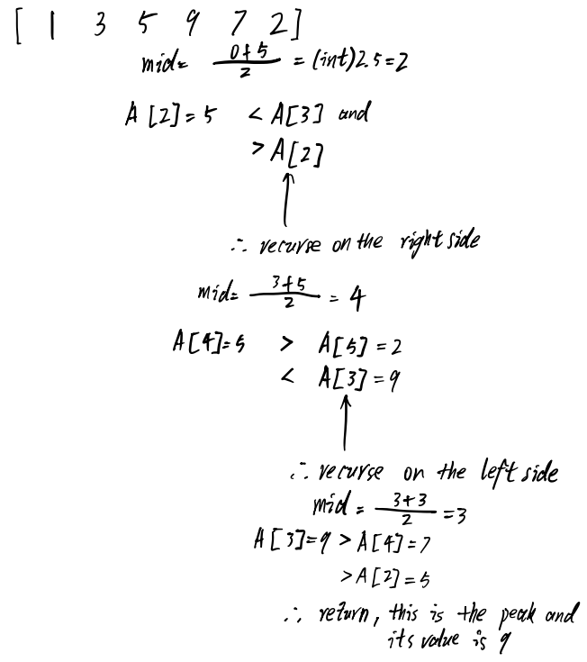

## Algorithm
To approach this problem, I used a method similar to binary search, which is to divide the array into sections and perform comparison.
Here is a high-level algorithm description for the problem:
1. The problem is to find the index P where the peak value occurs in an array A of length n.
2. Divide the array A from indices low to high into two halves.
3. Compare the middle element A[mid] to the element after it A[mid+1].
4. If A[mid] < A[mid+1], the peak is in the right half. Recursively search the right half by setting low = mid+1.
5. Else, A[mid] >= A[mid+1], the peak is in the left half. Recursively search the left half by setting high = mid.
6. Base case is when low == high, return this index as the peak P. 
7. Return the index P and value A[P] from the recursive calls.
A drawn diagram of the algorithm is shown below:

This algorithm leverages divide and conquer to reduce the search space in half each recursion, resulting in O(log n) time complexity. The peak index and value are returned once the base case of a single element is reached.

## Time Complexity Analysis
Let n be the size of the input array A.

Let T(n) denote the time complexity to find the peak index and value in an array of size n.

The algorithm works as follows:

Divide the array from indices low to high into two halves. Let's assume this takes O(1) time.
Compare A[mid] and A[mid+1] to determine which half has the peak. This takes O(1) time.
Recursively call the algorithm on the selected half. Let the size of the half be n/2.
Return the index and value once low == high (base case). This takes O(1) time.
Therefore, the recurrence relation is:
$$
T(n) = T(n/2) + O(1) + O(1)
\\ = T(n/2) + O(1)
$$

$$
a = 1 (constant\;dividing\;factor)\\
b = 2 (n/2)\\
f(n) = O(1) (work\; done\; outside\; recursion)\\
$$
$$
Therefore, T(n) = Θ(nlog_b(a)) = Θ(log(n))
$$

Hence, the time complexity of this divide and conquer algorithm is $O(log(n))$.

This makes sense since we are reducing the problem size by half at each recursive call, resulting in a O(log n) binary search style algorithm.