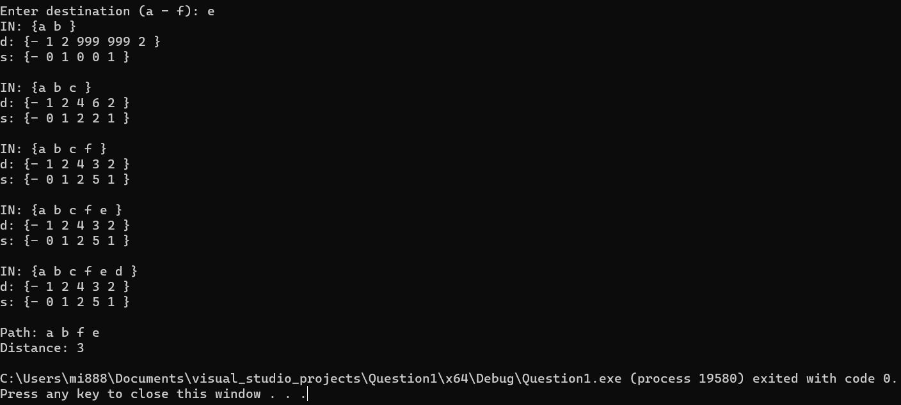
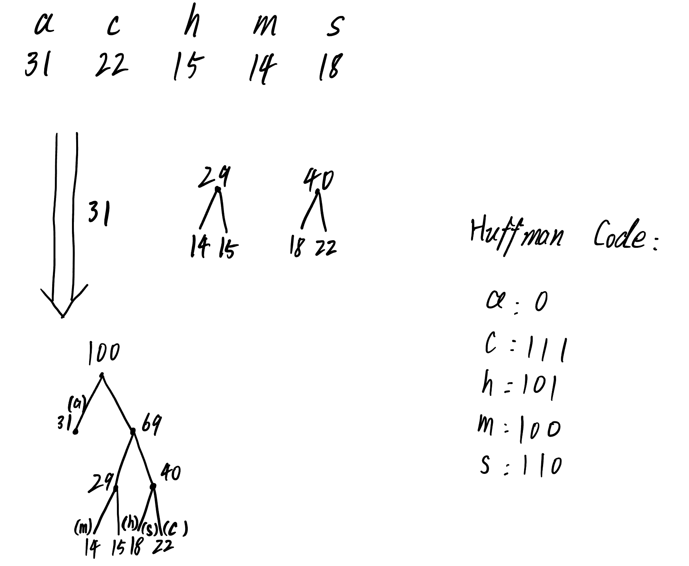

## Question 1
Given the graph, the following matrix was fed to the Dijkstra's algorithm.

||a|b|c|d|e|f|
|-|-|-|-|-|-|-|
|a|$\infty$|1|3|$\infty$|$\infty$|$\infty$|
|b|1|$\infty$|1|$\infty$|$\infty$|1|
|c|3|1|$\infty$|2|4|$\infty$|
|d|$\infty$|$\infty$|2|$\infty$|1|2|
|e|$\infty$|$\infty$|4|1|$\infty$|1|
|f|$\infty$|1|$\infty$|2|1|$\infty$|

(1) IN = {a}
| |a|b|c|d|e|f|
|-|-|-|-|-|-|-|
|d|0|1|3|$\infty$|$\infty$|$\infty$|
|s|-|a|a|a|a|a|

(2) IN = {a, b}
| |a|b|c|d|e|f|
|-|-|-|-|-|-|-|
|d|0|1|2|$\infty$|$\infty$|2|
|s|-|a|b|a|a|b|

(3) IN = {a, b, c}
| |a|b|c|d|e|f|
|-|-|-|-|-|-|-|
|d|0|1|2|4|6|2|
|s|-|a|b|c|c|b|

(4) IN = {a, b, c, f}
| |a|b|c|d|e|f|
|-|-|-|-|-|-|-|
|d|0|1|2|4|3|2|
|s|-|a|b|c|f|b|

(5) IN = {a, b, c, f, e}
| |a|b|c|d|e|f|
|-|-|-|-|-|-|-|
|d|0|1|2|4|3|2|
|s|-|a|b|c|f|b|

(6) IN = {a, b, c, f, e, d}
| |a|b|c|d|e|f|
|-|-|-|-|-|-|-|
|d|0|1|2|4|3|2|
|s|-|a|b|c|f|b|

d and s are unchanged.

End of optimization. 
I have also constructed a program for this. The program is written in c++.
The program was run with the source node as node a. The destination is user-determined.
Full output

## Question 2
Given the graph, the following matrix was fed to the Dijkstra's algorithm:
||0|1|2|3|
|-|-|-|-|-|
|0|$\infty$|5|$\infty$|2|
|1|3|$\infty$|3|-4|
|2|$\infty$|$\infty$|$\infty$|4|
|3|-1|$\infty$|-2|$\infty$|

(1) IN = {0}
| |0|1|2|3|
|-|-|-|-|-|
|d|0|5|$\infty$|2|
|s|-|0|0|0|

(2) IN = {0, 3}
| |0|1|2|3|
|-|-|-|-|-|
|d|0|5|0|2|
|s|-|0|3|0|

(3) IN = {0, 3, 2}
| |0|1|2|3|
|-|-|-|-|-|
|d|0|5|0|2|
|s|-|0|3|0|

(4) IN = {0, 3, 2, 1}
| |0|1|2|3|
|-|-|-|-|-|
|d|0|5|0|2|
|s|-|0|3|0|

End of optimization.

(2)The algorithm gives the shortest path from 0 to 3 is 0-1-3, with path length 1. node 3 is the first node into IN. As Node 1 is into IN later, but the distance for 3 was not re-evaluated. A similar situation happens to the path from 0 to 2. The Dijkstra's algorithm fails when there are negative weights, because with negative.

3. (1) Single Source shortet path problem has no solution in a graph with a negative weight cycle. 
Proof: Assume there is solution with a negative weight cycle for a graph G. Assume the shortest path from vertex S to vertex T is denoted as P(s,t).
Using the Dijkstra's algorithm, set all distance from S to infinite, set distance from S to S as 0. 
Then repeat the process for N-1 times. For each vertex in the graph, find the vertex with the shortest distance from S. If distance still gets updated, there is a negative weight loop in the graph. As traversing the loop reduces the total distance in the path, the shortest path possibly have a negative total weight, which contradicts its property. The shortest path does not exist.

(2) Non-negative weight cycle cannot be a part of a shortest path.
Proof: Assume there is a shortest path P(s,t) for a graph G. Given the definition of Cycle in Graph theory, a cycle is a empty path with the first and last node being the same. For Non-negative weight cycles, the local total weight of the cycle is >= 0. Therefore, the total weight of the path P(s,t) is >= 0. The shortest path cannot contain a non-negative weight cycle. This means that if path includes the cycle, it will have equal (in case that the cycle's weight is 0, which even though is not necessary to remove, makes sense to be eliminated) or greater weight not including it. Therefore, the shortest path does not include the cycle.
(3) The shortest path in a graph with n nodes cannot be longer than n-1 arcs. (a note to myself, arc is directed edge)
Proof: Assume there is a path P(s,t) with n arcs. If there is a shortest path exist, it should have a maximum of n nodes and n-1 arcs. This means that there is at least one node that is visited twice, meaning there are cycles exist in the path. As non-negative path should not be a part of the shortest path as we disussed in (2), the path P(s,t) cannot be the shortest path. As we have determined that no solution exists for a graph with negative weight cycles, the path P(s,t) does not satisfy as a shortest path with a presenting negative weight cycle.
This contradicts the assumption that the path is the shortest. Therefore, the shortest path in a graph with n nodes cannot be longer than n-1 arcs.

4.(1) This is a dynamic programming problem. The optimal subproblem is to find the shortest path to another vertex from each vertex. 

(2) Table 

|M|1|2|3|
|-|-|-|-|
|0|0|0|0|
|1|5|0|1|
|2|5|-1|1|
|3|5|-1|1|

||0|1|2|3|
|-|-|-|-|-|
|d|0|5|-1|1|
|s|-|0|3|1|

(3)  Does the Bellman-Ford algorithm solve the shortest path problem correctly for this particular graph?  Answer this question by comparing the results here with the results you got for problem 2(b). 

In problem 2(b), the result we got was
| |0|1|2|3|
|-|-|-|-|-|
|d|0|5|0|2|
|s|-|0|3|0|

The Bellman-Ford Algorithm found a more efficient shortest path.

(4) Give an order-of-magnitude upper bound for the work done by the Bellman-Ford algorithm as written above. 
The upper bound is O(v*e), where v is the number of vertices and e is the number of edges. 

5. Huffman tree problem

7. Counter Example:

| Task i | s(i) | f(i) |
|--------|------|------|
|1|1|7|
|2|6|9|
|3|8|12|

A = {2} rejecting task 1 and task 3
However, the optional solution is A={1, 3}

